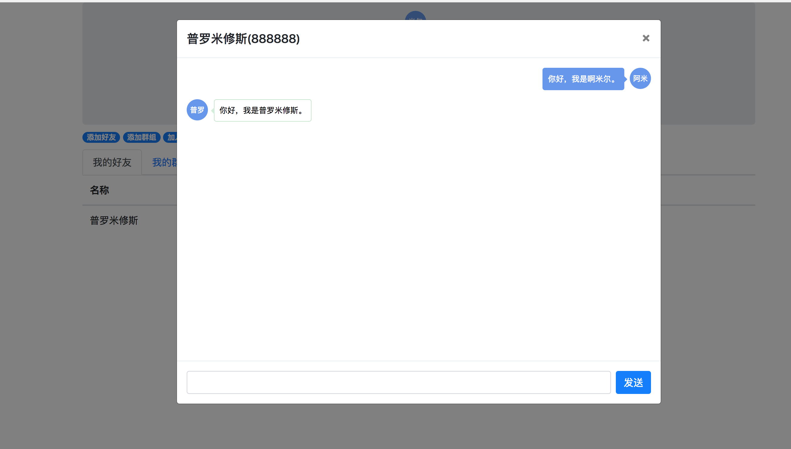
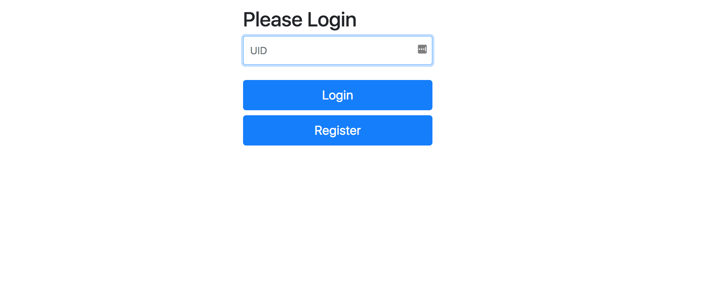

# goim

goim 是用golang 写的即时通讯

主要使用

  * go-socket.io 长链接
  * gin  RESTAPI
  * mysql 关系型数据库
  * mongo NOSQL
  * redis MQ


> 目前只支持了私聊  群组还在开发中。。。。。。

###示例




###启动方式

go server

```shell
cd goim
go build
./goim
```

html server

```shell
cd goim/www
npm install
npm start
```

依赖 mongo 和 mysql 数据库  请在config/dev.json 修改mongo 和 mysql 配置  redis不是必须

推荐docker 安装mongo  https://hub.docker.com/_/mongo/
           安装mysql https://hub.docker.com/_/mysql/
           安装redis  https://hub.docker.com/_/redis/

**后面加入docker 运行**

浏览器输入 http://localhost:3333/ 既可以进入登陆页面

